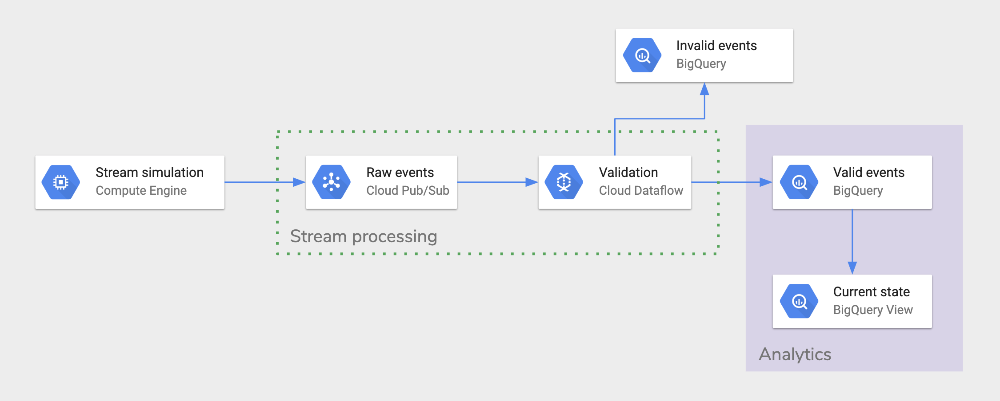
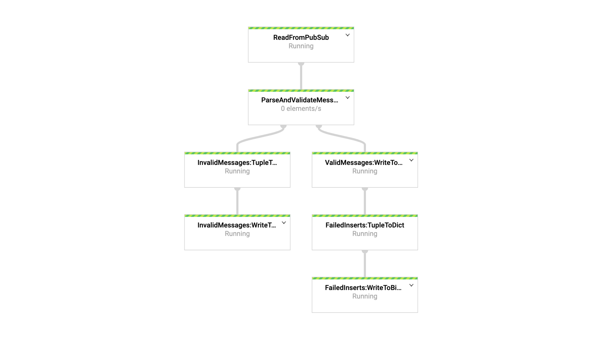
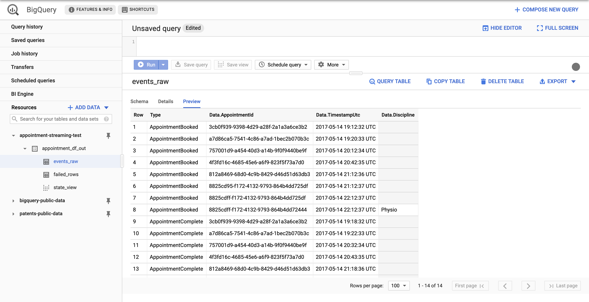

# Appointment streaming pipeline

Apache Beam streaming pipeline built in Python 3.7. Takes JSON messages from Cloud PubSub, streams messages to BigQuery after performing a validation step.

## Solution design

The solution was built using products from Google Cloud Platform.

### Components used

- Cloud PubSub: Serverless message queue.
- Cloud Dataflow: Managed runner for Apache Beam jobs. Built for large scale distributed data processing.
- BigQuery: Serverless data warehouse with a SQL interface.

_I used Cloud Scheduler and Compute Engine to simulate a message stream arriving to PubSub. Cloud Scheduler was used for development purposes. `pubsub/pubsub_publisher.py` was running on a Compute Engine Virtual Machine to publish each message from the sample data to PubSub._

### Architecture diagram



Dataflow acts as a glue in this architecture. It reads messages from PubSub and validates these messages. If a message is invalid it gets inserted into a `failed_rows` table, while valid messages are inserted into a `raw_events` table. A View is built on top of `raw_events` table in BigQuery which shows the latest state of each appointment.

### Apache Beam pipeline design

There are two validation steps performed in the Dataflow pipeline. One just after reading from PubSub which checks it the message is a valid JSON string. This step would filter out messages like `{ "Type": "AppointmentBooked", "Data": {`. After filtering out invalid messages, valid messages get inserted into a BigQuery table. Unsuccessful inserts are captured and inserted into a separate BigQuery table as a string. Processing steps are shown on the Dataflow DAG below.



A long living PubSub subscription is used to read from the PubSub topic. By default Beam creates short linging subscriptions for each pipeline run.
It's beneficial to use a long living subscription since messagages are retained in the subscription after a pipeline is cancelled or failed.

Finally, I chose Pyhton over Java to develop this streaming pipeline due to the prototype nature of this project and the time constraints. [Java has a lot of benefits over Python when it comes to Dataflow streaming](https://beam.apache.org/documentation/sdks/python-streaming/#unsupported-features). I would probably rewrite the pipeline in Java if I would have to productionise it.

### BigQuery tables

BigQuery tables created:

- `events_raw`: Stores valid messages. Dataflow inserts rows to this table using streaming inserts.
- `failed_rows`: Stores invalid messages as string. Dataflow inserts rows to this table using streaming inserts.

BigQuery views created:

- `state_view`: A BigQuery view on top of `events_raw` table which shows the latest rows for each `AppointmentId`. This view is based on the SQL query `bigquery/appointment_state_view.sql`.

Average appointment duration and average appointment duration by discipline can be easily calculated by querying the `events_raw` table. SQL query to calculate these metrics can be fount at `bigquery/appointment_avg_duration.sql` and `bigquery/appointment_avg_duration_by_discipline.sql`.

Below screenshot shows the preview of `events_raw` table in BigQuery.



## Running instructions

You can run the Apache Beam pipeline either locally or on top of Dataflow in Google Cloud Platform.

### DirectRunner

```bash
cd dataflow
python3 -m streaming_pipeline \
--subscription=projects/{project}/subscriptions/{subscription} \
--bigquery_table={project}:{dataset}.{table} \
--bigquery_table_for_failed_rows={project}:{dataset}.{table}
```

### DataflowRunner

```bash
cd dataflow
python3 -m streaming_pipeline \
--project={project} \
--temp_location={bucket}/temp \
--staging_location={bucket}/staging \
--runner=DataflowRunner \
--subscription=projects/{project}/subscriptions/{subscription} \
--bigquery_table={project}:{dataset}.{table} \
--bigquery_table_for_failed_rows={project}:{dataset}.{table}
```

## Considerations

**Handling changing data schema**

Some fields in the incoming JSON messages don't always exist. Fortunately I didn't have to worry to much about this issue since BigQuery can handle the absence of fields if the field type in the table schema is NULLABLE. If a field is abcent in a message BigQuery will automatically inserts null as a value. On the other hand, additional fields can cause issues. Inserts fail when a row has additional fields that don't match the schema. With my current solution these inserts fail on `events_raw` table and will go to the `failed_rows` table.

**Handling broken events**

Malformed JSON events are handled by a validation step in the Apache Beam pipeline. These events get inserted into the `failed_rows` BigQuery table as a string.

## Further improvements

This prototype doesn't have unit tests or integration tests. It could be improved by unit testing the transformations of the Beam pipeline, aslo by testing the pipeline end-to-end.
